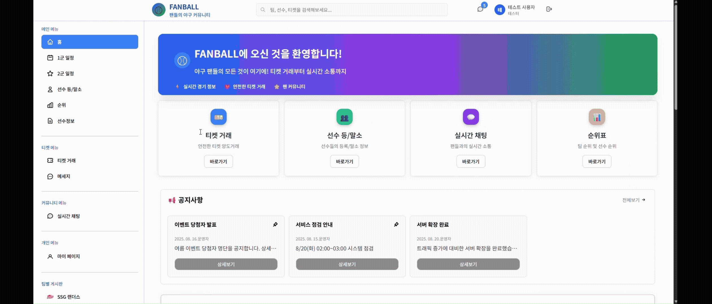
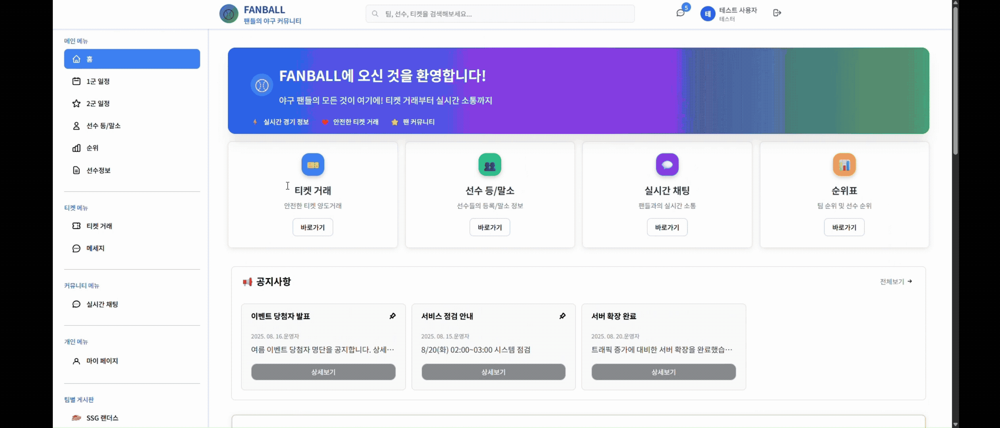

# FANBALL 프로젝트

# 주제: KBO 기반 야구 팬 커뮤니티 & 티켓 양도 플랫폼

## 개발 형태

---
Frontend: React, JavaScript

Styling: CSS

데이터 처리: JSON 기반 Mock 데이터

협업: Git, GitHub

## 목표

---

- KBO 실시간 정보를 제공, 팬간 커뮤니티, 실시간 메시징, 티켓 양도 기능을 통해 야구 팬 문화 확장

## 주요기능

---

- 회원기능
  - 회원가입 / 로그인
  - 비밀번호 변경 / 탈퇴
  - 응원 팀 설정
  - 프로필 수정
  - 마이페이지 (티켓 판매 내역, 응원팀 변경, 1:1 메시지, 거래내역, 게시판 작성 내역)

- KBO 관련
  - 1군
    - 실시간 경기 일정
    - 경기 결과
    - 각 경기 채팅방 자동 개설
    - 선수 등/말소 기록
    - 순위
  - 2군
    - 경기일정
    - 경기 결과
    - 선수 등/말소 기록
    - 각 경기 채팅방 자동 개설
- 팬 커뮤니티 기능
  - 팀별 게시판(응원게시판, 정보공유)
  - 댓글
  - 경기별 실시간 채팅방
  - 신고/ 차단 기능
- 티켓 거래 시스템
  - 티켓 등록(날짜, 팀, 좌석, 가격 → 가격은 각 구장별 가격에 따라)
  - 거래 상태 (신청/ 수락/완료 처리)
  - 실시간 티켓 거래 대화 기능
    - 1:1 쪽지
    - 읽음 여부 표시
  - 후기 작성 기능
  - 신고 기능
- 관리자 기능
  - 유저 관리(신고, 제재 등 )
  - 신고 처리
  - 관리자 등록

## TroubleShooting
1️⃣ Mock 데이터 기반 화면 구성 및 배포 문제 해결 ⭐

```
문제: 외부 API를 사용할 수 없는 환경에서 데이터를 기반으로 한 UI 구성이 필요했으며,
GitHub Pages 배포 환경에서 JSON 파일이 정상적으로 로드되지 않는 문제가 발생했습니다.

원인: 정적 배포 환경에서의 경로 문제(PUBLIC_URL)와 날짜 필터 로직으로 인해 데이터가 
		 정상적으로 렌더링되지 않았습니다.

해결: public 디렉토리에 mock JSON 파일을 구성하고,
		 fetch("/mockX.json") 방식으로 데이터를 불러오도록 구현했습니다.
		 또한 배포 환경에 맞게 fetch 경로를 보정하고, 
		 날짜 필터 로직을 수정하여 실제 데이터가 정상적으로 표시되도록 개선했습니다.

결과:
- GitHub Pages 환경에서도 안정적으로 데이터 렌더링 가능
- API 없이도 실제 서비스와 유사한 데이터 흐름 구현
- 추후 API 연동 시에도 재사용 가능한 구조 확보
```

---

2️⃣ 사이드바 메뉴 활성화 상태 관리

```
문제: 현재 페이지에 따라 사이드바 메뉴의 활성 상태를 표시할 필요가 있었습니다.

원인: 페이지 이동 시 상태 관리가 분리되어 있어 UI 일관성이 유지되지 않았습니다.

해결: 현재 경로를 기반으로 activeMenu 값을 전달하여,
		 SideBar 컴포넌트에서 선택된 메뉴에 스타일을 적용하도록 구현했습니다.

결과:
- 사용자 현재 위치를 직관적으로 인지 가능
- UI 일관성 향상
```

---

3️⃣ 레이아웃 구조 개선 (SPA 구조 설계) ⭐

```
문제: 페이지 이동 시 전체 화면이 리렌더링되며 사용자 경험이 저하되었습니다.

원인: 공통 레이아웃(Header, SideBar)이 페이지마다 중복 렌더링되는 구조였습니다.

해결: App.js에서 Header와 SideBar는 고정하고,
		 중앙 콘텐츠 영역만 React Router의 Routes를 통해 교체되도록 구조를 개선했습니다.

결과:
- 불필요한 렌더링 제거
- 페이지 전환 속도 및 사용자 경험 개선
- 유지보수성과 확장성 향상
```


## 사이트맵(SITEMAP)


## UI/UX 디자인 -> Figma를 활용해 시안 제작 (UI/UX 설계를 위한 시각적 설계 자료)

Figma => typeScript로 구현

Project => React로 구현

## Figma Url

[UI/UX](https://www.figma.com/make/OuYP9uKhA7Jl9l0XZMLl21/KBO-%ED%8C%AC-%EC%BB%A4%EB%AE%A4%EB%8B%88%ED%8B%B0-%EC%9B%B9%EC%82%AC%EC%9D%B4%ED%8A%B8?node-id=0-1&t=aCwpNBQCaE6GqFpb-1)

## 시연 영상 (핵심 기능)

- 메인화면 데이터 랜더링
  

- 사이드바 활성화
  

- 게시판 필터링, 페이징
  

- 페이지 전환
  

## 시연 링크

[GitHub Page](https://yeonison.github.io/fanball)
